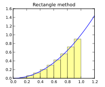

Team Tutorial #1: Lists and Loops
=================================

Since this is our first team tutorial, let's go over the basics of these
tutorials, and how to get the most out of them.

Learning how to program is, in many ways, very similar to learning a foreign
language: you could memorize all the rules of the language, and still not
be able to speak the language fluently. The way you get better is not just
by practicing, but by practicing *with others*.

In particular, when you practice speaking a new language with other people
(even if they're not native speakers), it is much easier to overcome obstacles
as you learn the language.
If you don't know how to say something, it's possible someone else in the group
will know how to say it. And if you say something that's not quite right, or
just not idiomatic, there's a chance someone in the group will be able to
correct you. These are all valuable interactions that are impossible if
you just practice by yourself.

So, think of these tutorials as an opportunity to practice your programming skills
with other students, and to learn off each other. And remember that these tutorials
are ungraded: you don't have to submit anything or worry about how your work
will be assessed. We are providing them as a way for you to practice your
programming skills before you have to do any graded work in a given module.

As far as how to work through the tutorial, we suggest you find a group
of 3-4 students and then structure your work in one of the following
ways:

#. Allocate 60-90 minutes to meet together, and work through the tutorial step
   by step together. When it comes to the exercises that are sprinkled throughout
   the tutorial, it is important that you work through them on a computer, and
   arrive at a working solution, as opposed to just having a high-level discussion
   about the problem. That said, it can be useful to have one person propose a
   solution on a whiteboard or by sharing their screen,
   while encouraging others to pitch in with suggestions, and to ask questions
   if they're unsure about a given solution.
#. Alternatively, have everyone in the group work through the tutorial *before* meeting,
   and then use your meeting time to compare and contrast your solutions.

Please note that, in each module, we will be posting solutions to the team tutorial at
around the time the programming assignment is released. However, just reading through
these solutions is no substitute for working through the tutorial with your team! Instead,
it can be very valuable to compare your solutions with ours, and to ask questions if
your approach was substantially different from ours (e.g., you may have arrived at a solution
that produces a correct result, but that is poorly designed or is inefficient).

.. admonition:: Academic Honesty reminder

   In these tutorials, you are allowed and encouraged to do your work collaboratively,
   including sharing your solutions to the tutorial exercises.

   Please remember that **you are NOT allowed to do this anywhere else in this
   course**. Never share or discuss your work on the Short Exercises or Programming
   Assignments with anyone. This can be a good moment to
   re-read our :ref:`academic_honesty` page.

Structure of this tutorial
--------------------------

Before you begin working on Programming Assignment #1, you should make sure you know how to:

- do basic operations on lists
- use for-loops to write repeated code
- write code to construct new lists, append to existing lists, and index positions within a list

This tutorial will help you practice those skills.  It has two main
sections:

* **Part 1: Simple practice**: This practice will help you gain familiarity with lists and loops, which are fundamental building blocks of much of the code you'll write in this class. This activity should take about 30 minutes to complete and will help prepare you to do PA #1.

* **Part 2: Extended activity**: if you would like additional practice prior to starting the PA, we have provided a more complex exercise that provides a more interesting use case for the concepts from class.

Please note that, while you could do both of these activities with your team in one sitting, it may be better to work through the first part earlier in the module,
and the second part once you've become more comfortable with lists and loops.

Getting started
---------------

.. Before working through this tutorial, make sure you've worked through the
    {git_tutorial_link} to make sure you understand
    how repositories are created in this class, and how to fetch files
    from an upstream repository.

Using the invitation URL provided on Ed Discussion, create a repository
for your Team Tutorial files (you will be using this repository not just
for this team tutorial, but also for all subsequent ones this quarter).

Next, make sure you've
set the ``GITHUB_USERNAME`` variable by running the following (replacing ``replace_me``
with your GitHub username)::

       GITHUB_USERNAME=replace_me

(remember you can double-check whether the variable is properly set by
running ``echo $GITHUB_USERNAME``)

And finally, run these commands inside whichever directory you are using
to store your 121 files (if you don't recall what some of these
commands do, they are explained at the end of the Git Tutorial):

::

      cd ~/{course_number_lower}
      mkdir team-tutorials-$GITHUB_USERNAME
      cd team-tutorials-$GITHUB_USERNAME
      git init
      git remote add origin git@github.com:{github_org}/team-tutorials-$GITHUB_USERNAME.git
      git remote add upstream git@github.com:{github_org}/team-tutorials{extension}.git
      git pull upstream main
      git branch -M main
      git push -u origin main

You will find the files you need for this tutorial in the ``tt1`` directory.

Simple practice: Lists
----------------------

Lists provide a way to represent ordered sequences of data. They are
an essential part of programming in Python and you will use them
repeatedly in your work.

For the remainder of this section, we will review some basic list concepts,
and then give you some tasks to work on. When you get to these tasks,
We suggest that one person in the team have
``ipython3`` open and visible to everyone, and that you all collaboratively
decide on the answer to each task. Some of the tasks will ask
you to predict what the outcome of a given operation will be; make
sure to discuss this in a group before actually typing anything
into ``ipython3``.

If you get stumped in any of these, you may want to see if you can
figure out the answer by re-reading the relevant sections of the book.
If you get really stumped, don't hesitate to ask for help.

Literals
~~~~~~~~

List literals are written using square brackets with the individual
elements separated by commas. The empty list is written as ``[]``.

Let's create a few lists by copy-pasting the following into ``ipython3``:

.. code-block:: python

    lst0 = []
    lst1 = [1, "abc", 5.7, [1, 3, 5]]
    lst2 = [10, 11, 12, 13, 14, 15, 16]
    lst3 = [7, -5, 6, 27, -3, 0, 14]
    lst4 = [0, 1, 1, 3, 2, 4, 6, 1, 7, 8]

These are the example lists we will use in this part of the tutorial.
Remember, you can see the value of a list just by typing its name in
``ipython3`` (try doing this now to make sure you've created the lists):

.. code-block:: ipython

    In [5]: lst0
    Out[5]: []

    In [6]: lst1
    Out[6]: [1, 'abc', 5.7, [1, 3, 5]]

    In [7]: lst2
    Out[7]: [10, 11, 12, 13, 14, 15, 16]

Notice how variable ``lst0`` refers to an empty list.  The variable ``lst1``
refers to a list with four elements: an integer, a string, a floating
point number, and a list. Variables ``lst2``, ``lst3``, and ``lst4`` each refer
to a list with some integers in them.

**Task 1**: Create a list that contains the values 7, "xyz", and 2.7

Length
~~~~~~

You can find the length of a list using the built-in ``len`` function.
The expression ``len(lst0)``, for example, will evaluate to 0.
Evaluating the expression ``len(lst2)`` will yield the value 7.

**Task 2**: Predict what the expression ``len(lst1)`` will produce and then try it out

Indexing
~~~~~~~~

When used in an expression, the indexing operation (``[]``) is used to
retrieve the value of the i-th element of a list.  That is, given a
list ``lst``, the expression ``lst[i]`` will evaluate to the value of the
i-th element of the list.  Here are some example uses of the indexing
operation:

.. code::

    In [3]: lst2[0]
    Out[3]: 10

    In [4]: lst2[1]
    Out[4]: 11

Notice that we use zero to get the first element of the list and that
the last element in a list, ``lst``, is at index ``len(lst)-1``.  **All
indexing is zero-based in Python.** In other words, in a list with five
elements, the first element is at index 0, while the last element is at
index 4.

**Task 3**: Write an expression to retrieve the value ``5.7`` from list ``lst1``

**Task 4**: Predict what will happen if you evaluate the expression ``lst1[4]`` and then try it out.

**Task 5**: Predict what happens if you evaluate the expression ``lst2[-1]`` and then try it out.

.. note:: Debugging Hint

    Forgetting about zero-based indexing is the source
    of two kinds of problems in Python: (1) retrieving the second element
    when you want the first and (2) indexing beyond the end of the list in
    an attempt to get the last item in the list.  The first of these
    problems can be difficult to track down, because your program will not
    fail at the point of the error.  In fact, it may not fail at all!  The
    second problem will cause your program to fail, which can be
    frustrating, but at least you know there is a problem!

The result of indexing into a list could yield a value that itself may be a list,
which can be indexed into like any other list:

.. code::

    In [5]: lst1[3]
    Out[5]: [1, 3, 5]

    In [6]: lst1[3][0]
    Out[6]: 1

**Task 6**: Write an expression to retrieve the value ``5`` from the last element of ``lst1``.

Lists are mutable. That is, we can change them.  To change the value
at index ``i`` in list ``lst``, you simply put ``lst[i]`` on the left-hand
side of an assignment statement.   For example:

.. code::

    In [6]: lst1[2] = "xyz"

    In [7]: lst1
    Out[7]: [1, 'abc', 'xyz', [1, 3, 5]]

Notice that the statement ``lst1[2] = "xyz"`` changes the value at index 2
from ``5.7`` to be the string ``"xyz"``.

**Task 7**: Write a statement to change the value ``3`` inside the last element of ``lst1`` to ``15.0``.

Slicing
~~~~~~~

In addition to getting a single value from a list, it can be useful to
extract a copy of a sub-list from a list.  The slicing operation
(``:``) is used for this purpose.  The expression ``lst1[1:3]``, for
example, yields a *new* list with the value ``['abc', 5.7]``.  Notice
that the slice yields the elements from indices up to, **but not
including**, the upper bound.  To make a copy of a list ``lst``, of length ``N``, you
can use the expression ``lst[0:N]``.

The expression on either side of the colon (e1 : e2) or even both
expressions can be left out.  The default value for the first
expression (e1) is 0. The default value for the second expression is
the length of the list.  Here are some example uses of slicing:

.. code::

    In [15]: lst1[1:3]
    Out[15]: ['abc', 5.7]

    In [16]: lst1[:3]
    Out[16]: [1, 'abc', 5.7]

    In [17]: lst1[1:]
    Out[17]: ['abc', 5.7, [1, 3, 5]]

    In [18]: lst1[:]
    Out[18]: [1, 'abc', 5.7, [1, 3, 5]]

**Task 8**: Write an expression to create a slice containing the elements of index 1 through index 5 (inclusive) of list ``lst2``.

**Task 9**: Write an expression to create a slice containing the first three elements of list ``lst2``.

**Task 10**: Write an expression to create a slice containing the elements of index 1 through the last element (inclusive) of list ``lst2``.

Useful operations on lists
~~~~~~~~~~~~~~~~~~~~~~~~~~

For these remaining tasks, you will need to rely on operations covered in
class and in the book. Unlike the previous tasks, we are not giving you
examples beforehand. Not just that, each task could be solved a few different
ways. We encourage you to each come up with your own solution, and then
share it with the rest of the group.

**Task 11**: Add four elements to list ``lst0`` and then retrieve the element at index 3.

**Task 12**: Create a new list ``nl`` by concatenating list ``lst2`` with ``lst3``. Then, update an element of ``nl``. You'll notice that neither ``lst2`` or ``lst3`` change as a result of this update. Discuss as a group why that is the case.

Simple practice: Loops
----------------------

Loops provide a mechanism for repeatedly performing a computation.
They are often used in conjunction with lists in Python.  As in the
last section, this section contains a collection of tasks with links
to discussions of the necessary concepts.

The list tasks were simple enough that you could easily type the
solutions into ``ipython3`` directly.  While you can continue to
use ``ipython3`` to experiment with loops, you may also want to
put your your code in
a file (we have provided an empty ``loops.py`` for this purpose) and
then run the file from the terminal::

    $ python3 loops.py

.. We recommend reviewing the `Using an editor` section of the {linux_tutorial_link} before you get started on this section.

**Remember to save any changes that you make to the file before
re-running it from the terminal**

Basics
~~~~~~

The most basic loop in Python is the for-each loop:

.. code::

    for <var> in <expression>:
        <body>

The expression must yield a value, such as a list or a string, that
can be iterated over.  We will explain this construct using lists to
start.  For each iteration through the loop, the variable (``<var>``) takes on
a value from the list starting at index 0 and proceeding in order.

Here is an example loop:

.. code::

    In [1]: lst1 = [1, "abc", 5.7, [1, 3, 5]]

    In [2]: for y in lst1:
       ...:     print("y = " + str(y))
       ...:
    y = 1
    y = abc
    y = 5.7
    y = [1, 3, 5]

Please note that ``...:`` is the prompt that ipython3 uses when a
piece of code is spread over multiple lines.  It is not part of the
syntax of the for loop.

**Task 13**: Write a loop to compute a variable ``all_pos`` that has the value ``True`` if all of the elements in the list ``lst3`` are positive and ``False`` otherwise.

Combining loops and append
~~~~~~~~~~~~~~~~~~~~~~~~~~

It is very common to use loops to create new list from an existing
list.  For example, here is code that generates a new list (``nl``) in
which the ith element of the new list is the square of the ith element
of a list ``lst``.

.. code::

    In [3]: lst = [1, 2, 3, 4, 5]

    In [4]: nl = []

    In [5]: for x in lst:
       ...:     nl.append(x*x)
       ...:

    In [6]: nl
    Out[6]: [1, 4, 9, 16, 25]

The variable ``nl`` initially refers to an empty list.  Every time
around the loop a new entry is added to the list.

**Task 14**: Write code to create a new list ``pos_only`` that contains only the positive values in the list ``lst3``.

**Task 15**: Write code that uses ``append`` to create a new list ``is_pos`` in which the ith element of ``is_pos`` has the value ``True`` if the ith element of ``lst3`` has a positive value and ``False`` otherwise

Counting values in a list
~~~~~~~~~~~~~~~~~~~~~~~~~

For this final task, you will once again have to draw from concepts covered in
class and in the book, but for which we have not provided examples here
in the tutorial. We'll give you a few hints: part of the solution involves
creating a list of size ``M+1`` initialized to all zeroes, you should
not use the ``count`` method anywhere in your solution, and you can solve
this problem by making a single pass through the list (you will not need
nested loops).

**Task 16**: Given a list ``lst4`` that contains values in the range from ``0`` to ``M`` inclusive, write code that determines ``M`` using the built-in ``max`` function and then creates a new list ``counts`` in which the ith element contains a count of the number of times the value i occurred in ``lst4``.

If you use the provided ``lst4`` list, the resulting ``counts`` list will be the following:

.. code::

    [1, 3, 1, 1, 1, 0, 1, 1, 1]

Part 2: Extended activity
-------------------------

Now that you have some practice with loops, we will move on to a more realistic
example.

In this section we will compute definite integrals using numeric
quadrature. The definite integral of a function is just the area under
the curve of that function between two x values. We can calculate this
area by filling in the curve with many small rectangles and then
adding up the area of each of the rectangles - this method is aptly
named `the rectangle method
<http://en.wikipedia.org/wiki/Rectangle_method>`_.

In the file ``integration_lab.py`` there is a function

.. code-block:: python

     def f(x):
         return x*x

We have not covered functions in class yet, but don't worry: all you need to
know is that this function takes a number and produces the square
of that number. Here are some sample uses of this function:

.. code-block:: ipython

    In [2]: f(3.0)
    Out[2]: 9.0

    In [3]: f(5.0)
    Out[3]: 25.0

In this sense, it is a mathematical function like sin or log: it takes
a real number and produces another real number. More specifically, the function ``f`` corresponds to the mathematical function :math:`f(x)
= x^2.` We will use a for loop to compute the integral of this
function from 0 to 1 using N rectangles.

.. math:: \int_0^1 f(x) \,\mathrm{d}x = \int_0^1 x^2 \,\mathrm{d}x

In the file ``integration.py``, we have provided the implementation
of the ``f`` function, as well as an empty ``integrate`` function where
you will write your code (similar to how you have to fill in a series of functions
in Short Exercises #1).

More specifically, you must add code to ``integrate`` to perform the following steps:

#. Decide on a number of rectangles ``N`` (10 is a good number to start).
#. Compute the width (``dx``) of your rectangles.
#. Create a ``total_area`` variable to store the sum of the areas of all the
   rectangles. Start it at zero.
#. Make a loop with a variable, ``i`` that ranges from from ``0`` up to, but not including, ``N``.
#. For each of these steps compute the area of the rectangle as
   height*width. Height is the value equal to the ``f`` function called on
   each ``i*dx`` and width is  ``dx``. Add this area to ``total_area``.
#. After the for loop, ``total_area`` should contain the value of the integral.
#. Celebrate; you have just replaced calculus.

Give the function a try from ipython3 (notice how, as in Short Exercises #1, we're
using the autoreload feature; that way, ipython will reload the code in ``integration.py``
automatically if you change that file):

.. code-block::

    $ ipython3

    In [1]: %load_ext autoreload

    In [2]: %autoreload 2

    In [3]: import integration

    In [4]: integration.integrate()
    Out[4]: 0.33328333499999957

The value of this integral should be:

.. math::
    \int_0^1 x^2 \,\mathrm{d}x = \left[\frac{x^3}{3}\right]_0^1 = \frac{1^3}{3} - \frac{0}{3} = \frac{1}{3} = .33333333...

Did your code compute the correct value?

Try your function again but set the number of rectangles to 100 instead. Try 1000.

How many rectangles do you have to use to obtain a result that is correct enough?

A final note on functions
~~~~~~~~~~~~~~~~~~~~~~~~~

Of course, this function is pretty limited: it computes the integral of a specific function,
between fixed bounds (0 and 1) and with a fixed set of rectangles. In Module #2: Functions, we will learn how we can
add *parameters* to the function, so we can compute the integral of function ``f`` with different bounds and rectangles.

When finished
-------------

Once you finish working on the tutorial, you should add, commit, and push
the files in the ``tt1`` directory. No, we won't be looking at them or grading
then, but this ensures you can access those files later on if you start
working on a different computer, and also allows us to look at them if you
do have any specific questions about your solutions.

